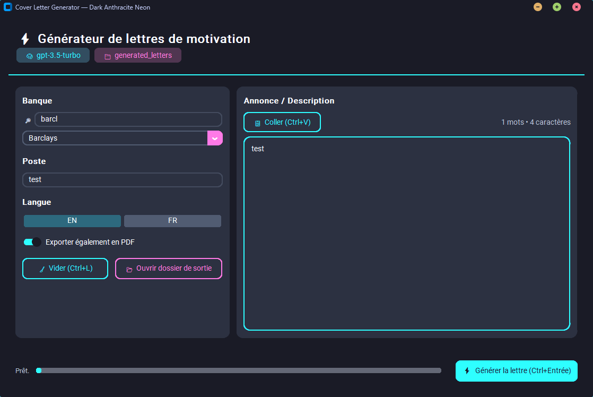

# Bank Cover Letter Generator  

Bank Cover Letter Generator is a Python tool that automatically generates personalized cover letters for banks and financial institutions. Based on a job description and your CV, the app creates a professional structured text, formats it into a Word (DOCX) document, and exports it as a PDF.  

## Preview  
  

---  

## Features  
- Graphical interface with CustomTkinter (basic design)  
- Pre-filled list of banks and financial institutions with integrated search  
- Generation of 3–4 tailored paragraphs using the OpenAI API (3.5-turbo model for cost efficiency)  
- Support for both English and French  
- Automated Word formatting (contact details, fonts, margins, spacing)  
- Automatic PDF export via Microsoft Word or LibreOffice  
- File organization by bank in the `generated_letters/` folder  

---  

## Installation  

Clone the repository:  
```bash
git clone https://github.com/Marianoooo45/bank_cover_letter_generator.git
cd bank_cover_letter_generator
```  

Create a virtual environment and install dependencies:  
```bash
python -m venv .venv
.venv\Scripts\activate   # Windows
# or
source .venv/bin/activate   # Linux / macOS

pip install -r requirements.txt
```  

Set up environment variables:  
```bash
cp .env.example .env
```  

Edit `.env` to add your OpenAI key and personal information:  
```dotenv
OPENAI_API_KEY=sk-xxxxxxx
USER_FULLNAME=Your Name
USER_ADDRESS=Your Address
USER_CITY_COUNTRY=Your City – Country
USER_PHONE=+33 6 00 00 00 00
USER_EMAIL=your@email.com

# Optional: if your CV is stored elsewhere than the project root
# CV_PATH=C:\path\to\cv.txt
```  

---  

## Local CV (important)  
The application reads a **cv.txt** file to personalize the letter and avoid random information.  
Search order:  
1. Path defined by the `CV_PATH` environment variable (optional)  
2. `./cv.txt` at the project root  
3. `cv.txt` in the current directory  

The public repository provides a **cv.example.txt** as a template. Create your own local `cv.txt` (same structure) and **do not commit it**.  

---  

## Usage  

Run the application:  
```bash
python app.py
```  

Steps:  
1. Select a bank  
2. Enter the job title  
3. Paste the job description  
4. Choose the language (EN / FR)  
5. Generate the letter → DOCX and PDF files are created in `generated_letters/<Bank Name>/`  

---  

## Project Structure  
```text
bank_cover_letter_generator/
├── app.py           # Graphical interface
├── config.py        # Load environment variables
├── llm_body.py      # Content generation (reads cv.txt if present)
├── writer.py        # Word document creation
├── export_pdf.py    # DOCX → PDF conversion
├── requirements.txt # Python dependencies
├── .env.example     # Example configuration
├── cv.example.txt   # Example CV text (cv.txt stays local)
├── .gitignore       # Excluded files (includes cv.txt and .env)
└── README.md        # Documentation
```  

---  

## Security  
- Never publish your `.env` file or your `cv.txt`.  
- Keep your API key private and only stored in environment variables.  
- `.gitignore` protects against accidental commits.  
- Quick check before pushing:  
```bash
git grep -n "sk-" -- .
```  

---  

## License  
This project is distributed under the MIT license.  
